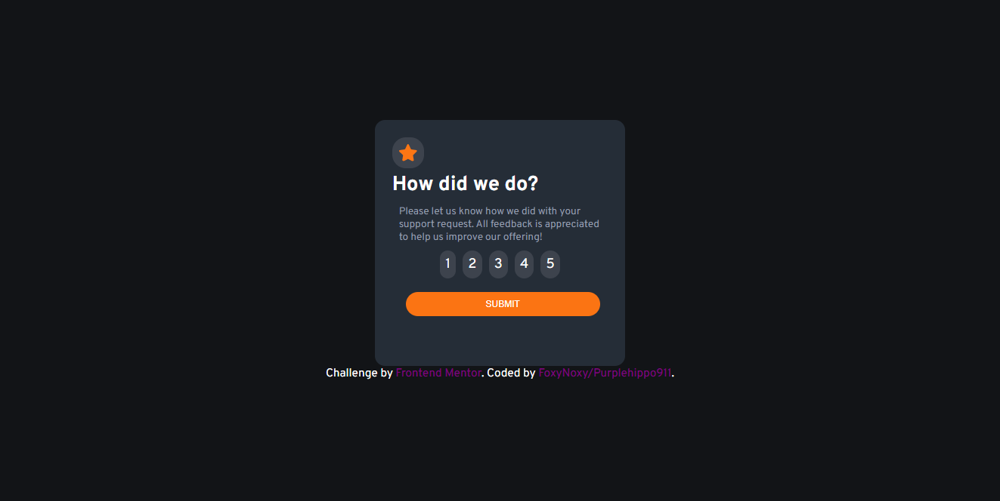
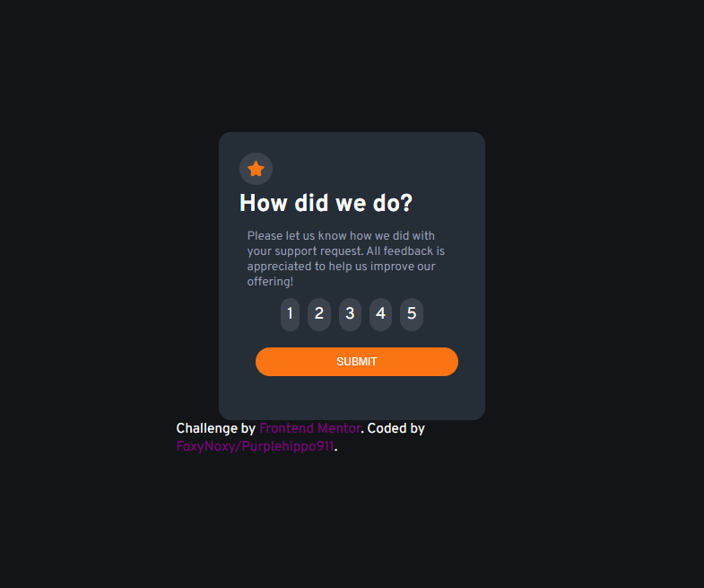

# Frontend Mentor - Interactive rating component solution

This is my solution to the [Interactive rating component challenge on Frontend Mentor](https://www.frontendmentor.io/challenges/interactive-rating-component-koxpeBUmI). Frontend Mentor challenges help you improve your coding skills by building realistic projects. 

## Table of contents

- [Frontend Mentor - Interactive rating component solution](#frontend-mentor---interactive-rating-component-solution)
  - [Table of contents](#table-of-contents)
  - [Overview](#overview)
    - [The challenge](#the-challenge)
    - [Screenshot](#screenshot)
    - [Links](#links)
  - [My process](#my-process)
    - [Built with](#built-with)
    - [What I learned](#what-i-learned)
    - [Continued development](#continued-development)
    - [Useful resources](#useful-resources)
  - [Author](#author)
  - [Acknowledgments](#acknowledgments)

## Overview

### The challenge

Users should be able to:

- View the optimal layout for the app depending on their device's screen size
- See hover states for all interactive elements on the page
- Select and submit a number rating
- See the "Thank you" card state after submitting a rating

### Screenshot
Desktop:



Mobile:




### Links

- Solution URL: [My solution](https://www.frontendmentor.io/solutions/interacitve-rating-component-with-flexbox-and-vanilla-js-SyxeY74Ec)
- Live Site URL: [My live site](https://purplehippo911.github.io/interactiveRating/)

## My process

### Built with

- Semantic HTML5 markup
- Vanilla JS
- CSS custom properties
- Flexbox

### What I learned

While I was doing this challenge I made sure to learn Flexbox and it helped me quite a lot to align the containers and items like I wanted. I learned a new html element called a `<dialog>` and I used that for the popup. 


```html
     <dialog id="dialog">
        
        <h2>
          You selected
          <span id="rate"></span>
          out of five.
        </h2>
        <h1>Thank you!</h1>
        <p id="dialog_info">
          We appreciate you taking the time to give a rating. If you ever need
          more support, don’t hesitate to get in touch!
        </p>
      </dialog>
```

```css
    #dialog {
      width:clamp(22rem, 50%, 25rem);
      height:clamp(20rem, 70%, 25rem);
      background-color: var(--DarkBlue);
      position:relative;
      display: flex;
      justify-content:center;
      text-align: center;
      gap:5px;
      border:0;
      border-radius:10px;
      display:none;
      opacity:0;
      transition:0.7s;
    }
```

```js
  buttons.forEach((button) => {
        button.addEventListener('click', () => {
            number = button.innerHTML;
            const htmlText = `<span>${number}</span> `;
            ratediv.innerHTML = htmlText;

        });
    });
```

### Continued development

I am planning on learning Grid and continuing on to the junior challenges at frontend mentor soon. I am thinking of making my own little website for fun, but I'm not sure. I'll hopefully do it.

### Useful resources

- [popup modal by Kevin Powell](https://www.youtube.com/watch?v=TAB_v6yBXIE&t=436s&ab_channel=KevinPowell) - This helped me with the popup. I really found the `<dialog>` element interesting, because I could just add the popup content to a `<dialog>` element.
- 
- [ What the flexbox](https://www.flexbox.io) - This is an amazing tutorial which helped me finally understand Flexbox. I'd recommend it to anyone still learning this concept.

## Author

- Discord - mashedapples222#7574
- Frontend Mentor - [@purplehippo911](https://www.frontendmentor.io/profile/purplehippo911)
- Github - [@purplehippo911](https://www.github.com/purplehippo911)


## Acknowledgments

This solution helped me quite a lot on my JS and some of my CSS. Heres a link to his/her solution. 


